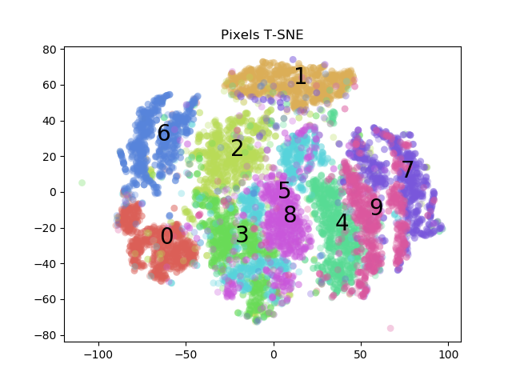
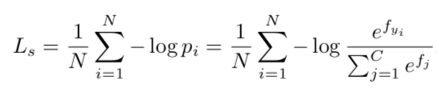
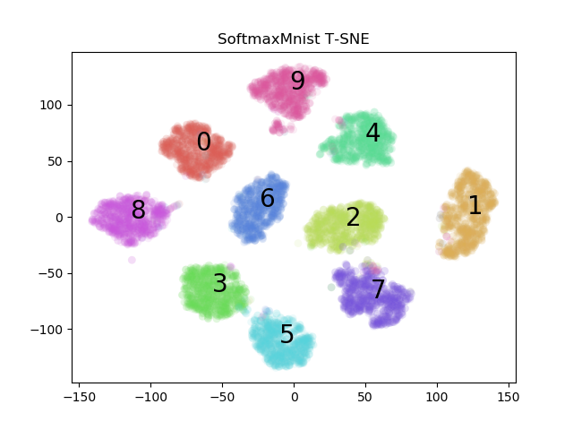
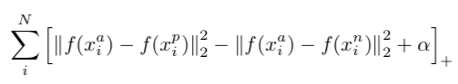
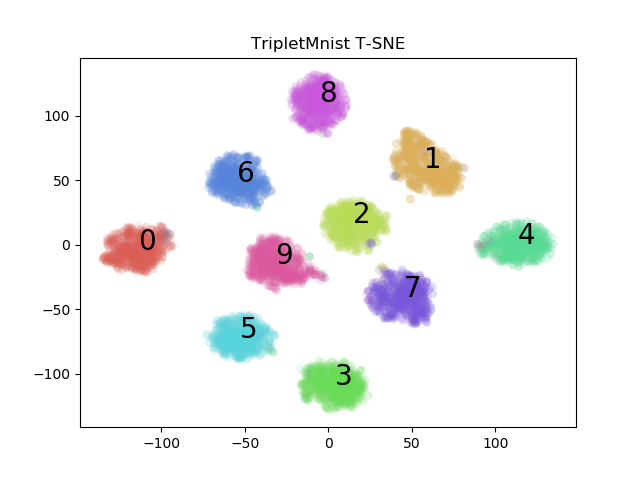
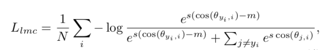
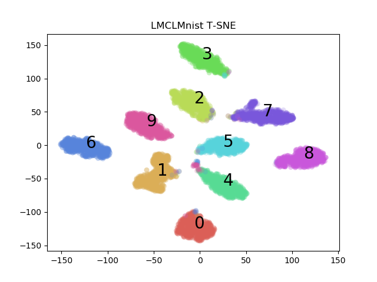
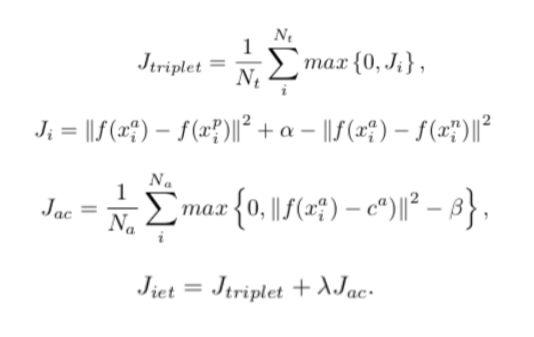
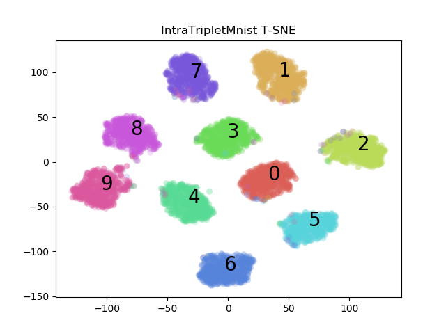
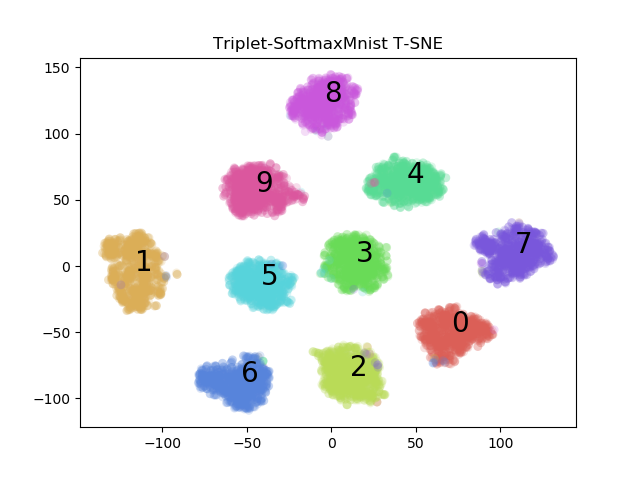

# Discriminating Power of Different Loss Functions on MNIST 
The purpose of this repository is to explore the discriminating power of different loss functions for classification, beyond the traditional softmax loss, on the **MNIST** dataset. The idea for maxmium discriminating capability is maximizing inter-class variance and minimizing intra-class variance.

## Evaluation Setup
I used the MNIST dataset provided by ```keras.datasets.mnist``` splitting the training data into 10% for validation (6000) and the rest for training (54,000). I saved the model with the lowest validation loss after ~100 epochs and evaluated it on the provided testing set (10,000). The generated embeddings where then reduced to 2-dimensions for visualization using t-SNE after 5000 iterations with a perplexity of 30. The aim from this viusalization is to determine the relative discriminating power of the loss functions by analyzing the inter and intra class variance on the different clusters formed.

## Results 
The different loss functions used are mathematically defined below along with the results of each on the testing set. 
First let's visualize t-SNE embeddings on the raw pixel data to give us a baseline of how the data is distributed before any clustering work is done.

### Raw Pixels (Baseline)
<p align="center"></p>

### Categorical Cross-Entropy (Softmax)
<table><tr>
  <td>
    
  </td>
  <td align="center"></td>
</tr></table>

### Semi-Hard Triplet Loss
<table><tr>
  <td>
    
    <h5>References:</h5>
    <ul>
       <li><a href="https://arxiv.org/abs/1503.03832">FaceNet: A Unified Embedding for Face Recognition and Clustering</a></li>
      <li><a href="https://arxiv.org/abs/1703.07737">In Defense of the Triplet Loss for Person Re-Identification</a></li>
    </ul>
  </td>
  <td align="center"></td>
</tr></table>

### Large Margin Cosine Loss
<table><tr>
  <td>
    
    <h5>References:</h5>
    <ul>
       <li><a href="https://arxiv.org/abs/1801.09414">CosFace: Large Margin Cosine Loss for Deep Face Recognition</a></li>
    </ul>
  </td>
  <td align="center"></td>
</tr></table>

### Intra-Enhanced Triplet Loss
<table><tr>
  <td>
    
    <h5>References:</h5>
    <ul>
       <li><a href="https://ieeexplore.ieee.org/document/8272723">Deep Dense Multi-level feature for partial high-resolution fingerprint matching</a></li>
    </ul>
  </td>
  <td align="center"></td>
</tr></table>

### Semi-Hard Triplet Loss + Softmax
<p align="center"></p>

### A-Softmax
TBD

### Contrastive Loss
TBD

---

> In any experiment using triplet loss, the data was ordered such that within each mini-batch there must be k samples for each class.
